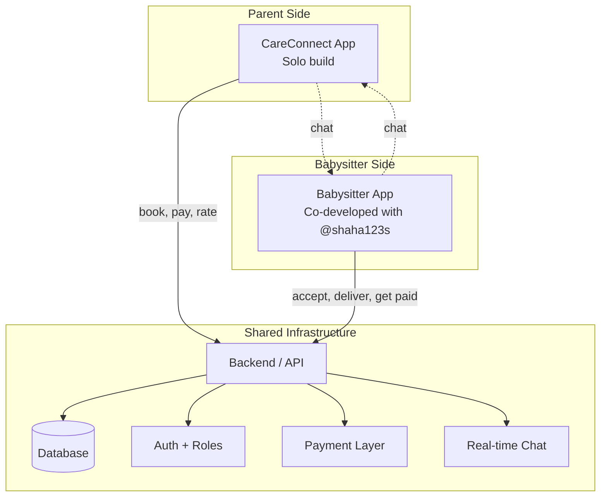

# 👶 CareConnect Platform

### A two-sided childcare marketplace — Flutter

*Connecting parents with vetted babysitters through a unified booking, scheduling, and communication platform.*

---

> [!NOTE]
> **This is a showcase repository.** The source code for both apps is private. This repository documents a two-sided marketplace I built — a Parent app (solo) and a Babysitter app (co-developed). For inquiries, please contact me directly.

---

## 📖 The Problem

Finding trustworthy, available, and qualified childcare on demand is one of the most stressful problems parents face. Existing solutions are fragmented: parents post on Facebook groups, babysitters advertise on Instagram, and bookings happen by DM — with no structure for credentials, no payment guarantee, and no rating system.

On the other side of the market, babysitters lack a professional platform to:
- Showcase certifications and experience
- Manage their schedule and availability
- Get paid reliably
- Build a reputation through verified reviews

## ✨ The Solution

A **two-app marketplace** that splits the user experience by role:

- **CareConnect (Parent App)** — for parents to search, book, communicate, pay, and rate
- **Babysitter App (Provider App)** — for babysitters to manage profile, certifications, availability, bookings, and earnings

Both apps share the same backend, the same data model, and the same trust system — but the UI and feature set are tuned for each persona.

---

## 🏗️ The Two-Sided Architecture

This is the classic two-sided marketplace pattern (Uber, Airbnb, TaskRabbit) — applied to childcare with care for verification and trust.

---

## 🎯 Features per App

### 👨‍👩‍👧 CareConnect (Parent App) — owned solo

<table>
<tr>
<td width="50%">

**Discovery**
- Browse babysitter profiles
- Filter by availability, certifications, distance
- View ratings and reviews
- Read verified credentials

**Booking**
- Pick date & time
- Send booking request
- Track status (pending → accepted → in-progress → completed)
- Cancel or reschedule

</td>
<td width="50%">

**Communication & Trust**
- In-app chat
- Booking details and history
- Comments and reviews
- Medical appointments coordination

**Payment**
- Pay via integrated gateway
- Booking-tied escrow
- Payment history

</td>
</tr>
</table>

### 👩‍🍼 Babysitter App (Provider App) — co-developed with [@shaha123s](https://github.com/shaha123s)

<table>
<tr>
<td width="50%">

**Profile Management**
- Personal info + photo
- Bio and experience
- Certifications & qualifications upload
- Hourly rate

**Verification**
- Document uploads (certificates, ID)
- Verification status badges
- Background-check workflow

</td>
<td width="50%">

**Booking Management**
- Inbox of incoming requests
- Accept / decline / propose alternative
- Calendar view
- To-do list per active booking

**Earnings**
- Booking history
- Earnings summary
- Comment & review responses

</td>
</tr>
</table>

---

## 🧰 Tech Stack

| Layer | Technology |
|---|---|
| Mobile (both apps) | Flutter / Dart |
| State Management | Provider (initial); migration to Riverpod planned |
| Backend | Firebase (Auth + Firestore) / Supabase (alternate consideration) |
| Real-time chat | Firestore listeners |
| File storage | Firebase Storage (certifications, photos) |
| Payment | Integrated payment gateway |
| Design | Figma — see [link below](#-design) |

---

## 🎨 Design

The visual design system, user flows, and prototypes for CareConnect live in Figma:

🔗 **[CareConnect Figma — ta3delat-llmarah-alalf](https://www.figma.com/design/8nNCv2zMnDqGnqq0y9z0i0/ta3delat-llmarah-alalf?node-id=4-963&p=f&t=O1b2YYEJMZ5BWpS3-0)**

The Figma file contains:
- Color tokens and typography
- Component library
- Screen-by-screen flows for both apps
- Interactive prototypes

> Note: Figma file may be view-only for unauthenticated visitors depending on share settings.

---

## 📊 Project Scale

| Metric | Parent App | Babysitter App |
|---|---|---|
| Lines of Dart | ~1.2M | ~515K |
| Size | 29 MB | 0.9 MB |
| Development | Oct 2024 – Feb 2025 | Jan 2025 – Feb 2025 |
| Status | Archived | Archived |
| Origin | FlutterFlow → manual refactor planned | FlutterFlow |
| My role | Solo founder + developer | Co-developer with @shaha123s |

---

## 🚀 Demo

> *Demo assets coming as the platform is revived.*

- 📱 APK download (Parent App): *coming soon*
- 📱 APK download (Babysitter App): *coming soon*
- 🎥 Video walkthrough — both sides of the marketplace: *coming soon*
- 🎨 Figma prototype: [link above](#-design)

In the meantime, see [screenshots/](screenshots/) for visual previews.

---

## 🔐 Trust & Safety Model

A childcare platform lives or dies on trust. Key safeguards designed into the system:

| Concern | Mitigation |
|---|---|
| Unverified babysitters | Required document upload, badge system |
| Unverified parents | Phone verification on signup |
| No-show or last-minute cancel | In-app rating affects future bookings |
| Disputes | In-app chat preserves evidence; admin can review |
| Payment safety | Payment held until booking completes |
| Underage babysitters | Age verification on profile setup |

---

## 👥 Project Roles

| App | Role | Collaborator |
|---|---|---|
| CareConnect (Parent) | Solo founder, designer, developer | — |
| Babysitter (Provider) | Co-developer | [@shaha123s](https://github.com/shaha123s) |
| Backend | Shared infrastructure | — |
| Design (Figma) | Designer | — |

---

## 📬 Contact

- **Email:** asaierafi@clinlab.ai
- **GitHub:** [@Mozn-jamous](https://github.com/Mozn-jamous)
- **LinkedIn:** [Mozn Jamous](https://www.linkedin.com/in/mozn-jamous)

For partnership opportunities to revive and scale the platform, or to discuss the two-sided marketplace architecture, please reach out directly.

---

## 📄 License

This repository and all its contents are © 2026 Mozn Jamous. **All rights reserved.** See [LICENSE](LICENSE).

The source code is not publicly available.

---

*Built in Damascus.*

