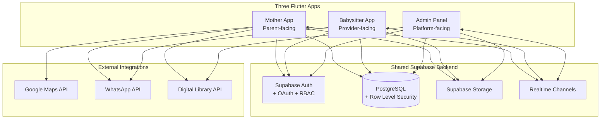
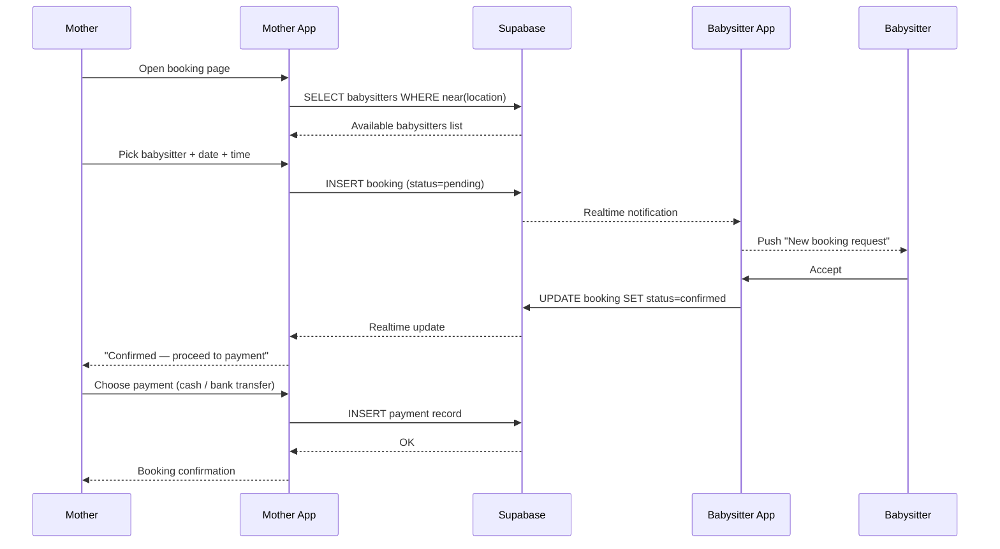
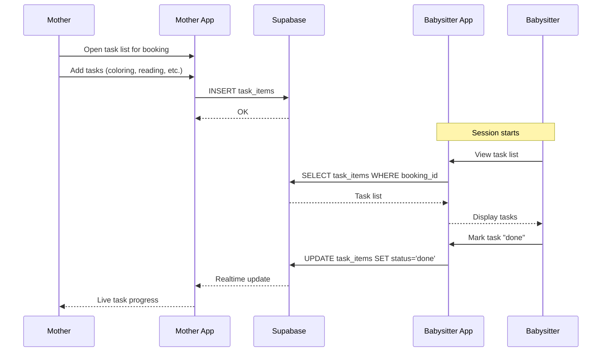
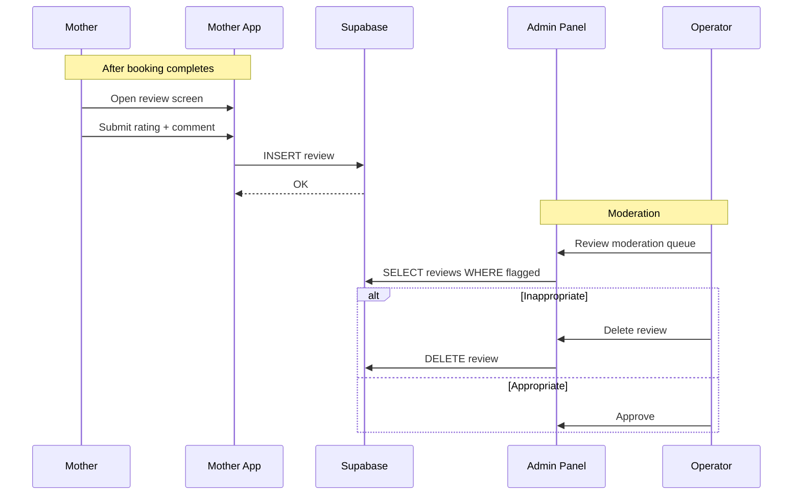
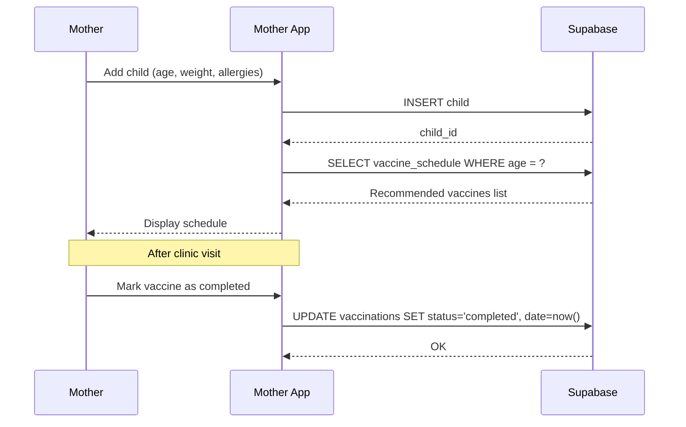

# CareConnect — System Architecture

This document describes the technical architecture of the CareConnect three-app ecosystem, with sequence and component diagrams.

## Table of Contents
- [System Overview](#system-overview)
- [Three-App Structure](#three-app-structure)
- [Shared Backend (Supabase)](#shared-backend-supabase)
- [External Integrations](#external-integrations)
- [Sequence: Booking Flow](#sequence-booking-flow)
- [Sequence: Task List](#sequence-task-list)
- [Sequence: Rating & Review](#sequence-rating--review)
- [Sequence: Vaccination Tracking](#sequence-vaccination-tracking)
- [Security & RBAC](#security--rbac)
- [Hardware & Software Interfaces](#hardware--software-interfaces)

---

## System Overview

CareConnect consists of **three Flutter applications** sharing a unified Supabase backend:



---

## Three-App Structure

### 1. Mother App
The primary consumer experience. Built on **Flutter with MVVM-lite + Provider** for state management.

Key modules:
- Authentication & profile
- Child management (multiple children)
- Babysitter discovery (Google Maps powered)
- Booking flow (create, edit, cancel)
- Payment recording (cash + bank transfer; no in-app gateway)
- Task list creation
- Vaccination scheduler
- Sleep tracker
- Meal tracker
- Medical appointment manager
- Rating & review submission
- Digital library viewer
- WhatsApp launcher for direct contact

### 2. Babysitter App (co-developed with @shaha123s)
The provider-side workflow. Tuned for fast booking response and live task updates.

Key modules:
- Authentication & profile
- Certification & qualification management
- Booking inbox (accept / reject)
- Active session task list (with done/not-done toggles)
- Schedule view
- Rating history

### 3. Admin Panel
The platform control surface. Built for operators, not end users.

Key modules:
- User search and management (activate / deactivate / edit)
- Payment records audit
- Comment moderation (review and delete inappropriate reviews)
- Digital library content management (upload / categorize / publish)
- System health overview

---

## Shared Backend (Supabase)

All three apps share a single Supabase project with **Row Level Security (RLS)** policies that enforce data isolation between users.

### Key Tables

| Table | Owned by | Purpose |
|---|---|---|
| `users` | Auth | Base account |
| `mothers` | RLS scoped | Parent profiles |
| `children` | RLS scoped | Child records linked to mother |
| `babysitters` | RLS scoped | Provider profiles |
| `bookings` | Cross-user | Booking records |
| `task_lists` | Booking-scoped | Mother-assigned task lists |
| `task_items` | Task-scoped | Individual tasks with done status |
| `payments` | Booking-scoped | Cash / bank transfer records |
| `reviews` | Cross-user | Mother-to-babysitter feedback |
| `vaccinations` | Child-scoped | Vaccination records |
| `sleep_logs` | Child-scoped | Sleep tracking entries |
| `meal_logs` | Child-scoped | Meal tracking entries |
| `appointments` | Child-scoped | Medical appointments |
| `library_content` | Public read | Educational materials |
| `admin_audit` | Admin-only | Operator action log |

### RBAC Policies

Three roles enforced at the database layer:

```sql
-- Mother can only see her own children and their data
CREATE POLICY mother_own_children ON children
  FOR ALL USING (auth.uid() = mother_id);

-- Babysitter can only see bookings assigned to them
CREATE POLICY babysitter_own_bookings ON bookings
  FOR ALL USING (auth.uid() = babysitter_id);

-- Admin can see everything (separate role)
CREATE POLICY admin_full_access ON {table}
  FOR ALL USING (auth.jwt()->>'role' = 'admin');
```

---

## External Integrations

### Google Maps API
- **Used by:** Mother App
- **Purpose:** Find nearby babysitters; show navigation routes
- **Auth:** Server-side API key, never exposed to client

### WhatsApp Business API
- **Used by:** Mother App, Babysitter App
- **Purpose:** Direct mother-babysitter communication after booking confirmation
- **Auth:** Phone-number-based deep links

### Babysitter App API (internal cross-app)
- **Used by:** Mother App ↔ Babysitter App
- **Purpose:** Real-time booking status, task list synchronization
- **Auth:** Shared JWT verified by Supabase

### Digital Library API
- **Used by:** Mother App, Admin Panel
- **Purpose:** Educational content delivery
- **Auth:** Public read, admin-only write

---

## Sequence: Booking Flow



---

## Sequence: Task List



---

## Sequence: Rating & Review



---

## Sequence: Vaccination Tracking



---

## Security & RBAC

### Authentication
- Supabase Auth with OAuth providers (Google, Facebook)
- JWT tokens with role claims
- Refresh-token rotation
- bcrypt password hashing

### Authorization (RBAC)
- Three roles: `mother`, `babysitter`, `admin`
- Enforced at the database via RLS policies
- No client-side role checks for sensitive operations

### Data Protection
- AES-256 encryption for sensitive fields at rest
- HTTPS / TLS 1.3 for all transit
- Signed URLs for Supabase Storage objects
- PII redaction in logs

### Compliance
- **GDPR-ready** — right to erasure, right to portability, data minimization
- **CCPA-ready** — opt-out flows, data sale prohibitions
- **WhatsApp Business policy** compliance for messaging

---

## Hardware & Software Interfaces

### Hardware
- **Camera** — for child photos, certification uploads, vaccination records
- **GPS** — for location-based babysitter search
- **Health sensors** (future) — integration with smartwatches for child activity

### Software
- **PostgreSQL** — primary data store
- **iOS + Android** — target platforms
- **Material Design + adaptive layouts** — UI consistency
- **RESTful APIs** for external service integration

### Communication
- **HTTPS / TLS 1.3** for all API traffic
- **WebSockets** via Supabase Realtime for live updates
- **Push notifications** for booking events, vaccination reminders, task updates
- **Email** for booking confirmations and account updates

---

## Standards Compliance

The system was designed following:

- **IEEE 830** for software requirements specification
- **REST** architectural style for APIs
- **OAuth 2.0** for delegated authorization
- **OWASP Top 10** mitigations for web/mobile security
- **WCAG 2.1 AA** (target) for accessibility
